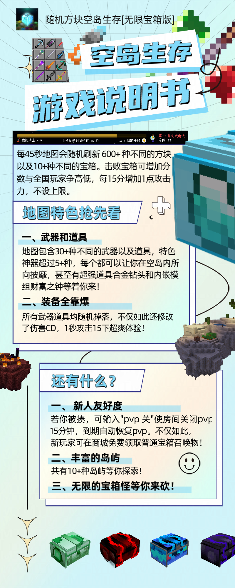
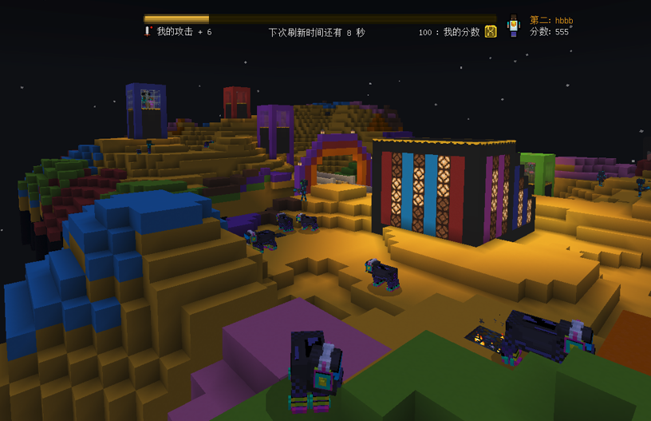

注意，该模组代码仅可用来预览，你无法装载在Minecraft国际版中。如果你想游玩该模组，请前往我的世界中国版基岩端中搜索开发者账号“刷怪笼工作室”，选择对应的模组购买并下载使用。如果你也是Minecraft爱好者，不妨点个Star支持下，谢谢！

Note that this module code is only available for preview and cannot be loaded into Minecraft International Edition. If you want to play this mod, please search for the developer account "Brushing Monster Cage Studio" in Minecraft China version of the bedrock platform, select the corresponding module to purchase and download for use. If you are also an MC enthusiast, why not click on Star support? Thank you!

20230913版本更新：

1.新增了8种电玩生物和1座电玩废墟岛（图在最后）。

2.修复了碳转换器特殊情况下无法转换为碳的bug。

3.修复了黄金片蓝剑和黄金片红剑无法合成的bug。

20230912版本更新：

1.新增18个空岛，4个宝箱（木乃伊/邪恶/蘑菇/彩虹），其中木乃伊和邪恶宝箱在其它空岛刷新。

2.优化了所有宝箱的掉率以及方块掉落数量。

3.新增20多把新武器，有一半需要在其他空岛获取。

4.新增难度修改，输入"难度 简单/普通/困难"即可。

5.修改了新手箱内的物品，现在更容易生存了。

6.现在刷怪箱里可以放宝箱召唤物了。

7.新增碳转换器，可以将手上任意物品转换为碳，以通过碳合成碳块搭路。

8.财富之钟仍在提审中，请稍安勿躁。

多人生存，幸运，运气，财富之钟，神器，新人。